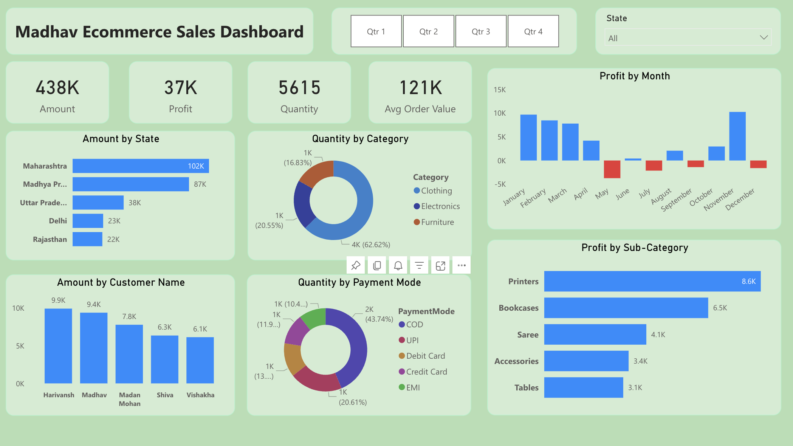

# Madhav Store Sales Analysis

Welcome to the Madhav Ecommerce Sales Dashboard project repository! This project is dedicated to building an interactive and dynamic dashboard for tracking and analyzing Madhav Store's online sales across India. Leveraging the power of Power BI, we've crafted a comprehensive Dashboard that empowers the store owner with critical insights into their online sales performance, facilitating data-driven decision-making and enhanced business strategies.

## Project Objectives and Recommended Analysis

The objective of the Madhav Ecommerce Sales Dashboard project is to assist the owner of Madhav Store in tracking and analyzing their online sales across India. By leveraging Power BI, we aim to provide an interactive dashboard that offers insights into sales performance, customer behavior, and regional trends.

- Which are the Top 5 state in terms of sales?
- Who are our Top Customers?
- Which category of Products(Clothings, Electronics and Furniture) are sold more and what is the Percentage?
- What are the Payement modes used and in what proportion?
- Which Sub-category of products sales leads to maximum Profit?
- How do Profit vary across different Months?
- What is our Average Order Value?

## Dataset Used

[Madhav Ecommerce Raw Dataset](datasets)

## Dashboard

